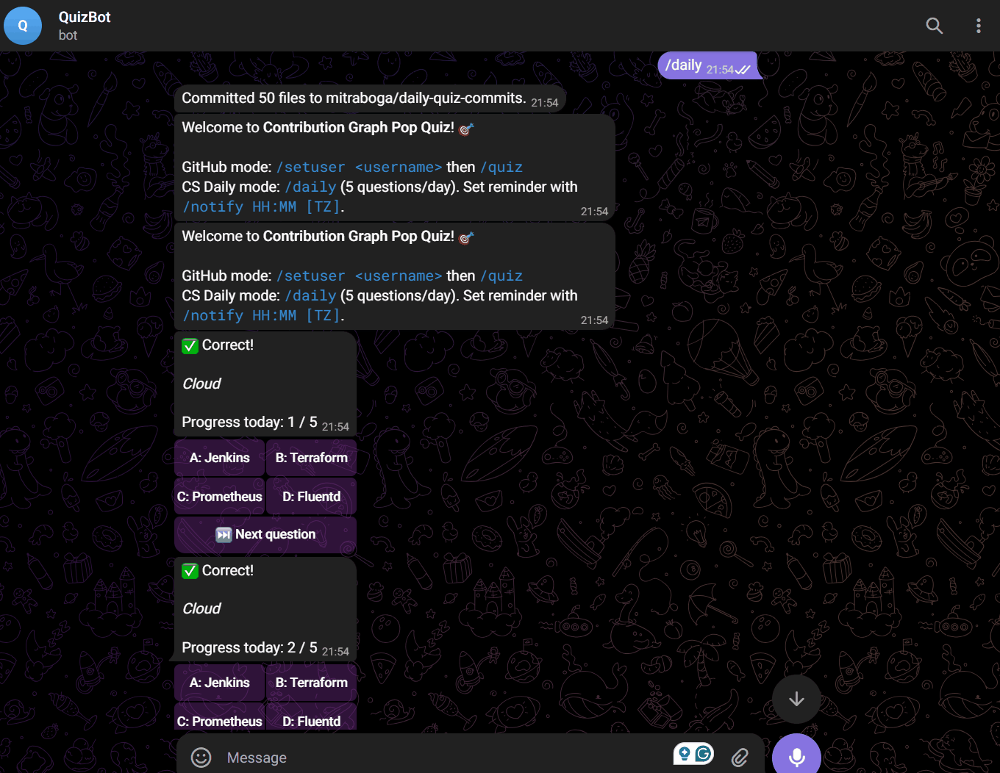

<h1 align="center">🤖 Contribution Graph Pop Quiz 🧠</h1>
<h3 align="center">Telegram Quiz Bot + Automated GitHub Commits for Daily Consistency</h3>

<p align="center">
  
  
  
  
  
  
  
  
  
  
  
</p>

---

<p align="center">
  <a href="https://mitraboga.github.io/CloudCostCalculator/" target="_blank" rel="noopener noreferrer">
    
  </a>
</p>

## Why I Created this Project

I wanted a **daily discipline** of contributing to GitHub—but I didn’t want to spam meaningless commits. Instead, I built a **Telegram bot** that sends me a **daily 5-question CS quiz** (DSA, Cloud, Cybersecurity, DevOps, AI/ML, Data Science, General CS). Each finished quiz day **creates 5 lightweight commits** to a repository I control. That way:

* I **learn** and sharpen my CS knowledge every day.
* I **keep my GitHub contribution graph green** with **purposeful activity**—one quiz = five commits.
* It’s **automatic** once configured, and runs **24/7** on Render (free tier) so I get my reminders even when my laptop is off.

---

## ⚙️What this project does

* Telegram bot with commands:

  * `/daily` — take a 5-question CS quiz
  * `/notify HH:MM [TZ]` — schedule a daily reminder (e.g., `/notify 07:30 Asia/Kolkata`)
  * `/when` — show your next reminder time
  * `/unnotify` — disable your reminder
  * `/streak` — show your current/best streak (completing all 5 in a day)
  * `/streakboard` — leaderboard per chat
  * `/setuser <github-username>` + `/quiz` — a separate GitHub contributions quiz mode
  * `/forcecommit [n] [tag]` — manual commits for testing (optional)
* Persists:

  * Scores and streaks in `quiz_scores.db` (SQLite)
  * Reminder preferences per user (time + timezone)
* After you answer **all 5 questions** for the day, it triggers **5 GitHub commits** via the GitHub API.
* Runs locally (polling) **or** in webhook mode. On **Render**, you can run:

  * **Polling + keepalive** (simple, works on free tier)
  * **Webhook mode** (custom URL path using a secret)

---

## 📐Architecture at a glance

```
main.py                 # Telegram bot, commands, scheduling, webhook/polling
questions.py            # Question bank + random question selection
quiz_engine.py          # GitHub contribution-graph question generator (original mode)
storage.py              # SQLite schema + CRUD for scores, reminders, streaks
github_committer.py     # Minimal GitHub API client to create file commits
requirements.txt        # Python dependencies
.env.example            # Example env vars (copy to .env locally; never commit real secrets)
```

**Key flows:**

* `/notify HH:MM TZ` → saves your reminder in DB → schedules a **daily JobQueue job** at that time in your timezone.
* At reminder time → bot DM’s you a quiz prompt → you answer Q1..Q5 → when you hit 5 **for that day**, the bot:

  1. Marks your day complete (streak++)
  2. Calls `github_committer.py` to create **5 commits** in your configured repo.

---

## 📄Requirements

* Python 3.11+
* A Telegram bot token from **BotFather**
* A GitHub repo to write commits to (e.g., `yourname/daily-quiz-commits`)
* A GitHub **Personal Access Token (PAT)** with minimal scopes:

  * Public repo: `public_repo`
  * Private repo: `repo`
* (Render deployment) A Render account

---

## 📲Installation (local)

```bash
# Clone your repo (omit if you already have it locally)
git clone https://github.com/<you>/Contribution-Graph-Pop-Quiz.git
cd Contribution-Graph-Pop-Quiz

# Create and activate a virtualenv (Windows PowerShell shown)
python -m venv .venv
.\.venv\Scripts\Activate.ps1

# Install dependencies
pip install -r requirements.txt
```

**Recommended `requirements.txt`:**

```txt
python-telegram-bot[job-queue]==20.7
python-dotenv==1.0.1
tzdata==2025.1
requests==2.32.3
```

---

## 💻Configure environment

Create `.env` (do **not** commit this file) based on `.env.example`:

```env
# Telegram
BOT_TOKEN=123456789:AA...fromBotFather...

# GitHub commits
GITHUB_TOKEN=ghp_xxx...   # classic PAT; public_repo or repo depending on target
GITHUB_REPO=yourname/daily-quiz-commits
GH_USER_NAME=Your Name
GH_USER_EMAIL=your-verified-email@example.com  # must be a verified GitHub email

# Timezone for defaults
TZ=Asia/Kolkata

# (Webhook mode only)
WEBHOOK_SECRET=some-long-random-string
BASE_URL=https://your-render-service.onrender.com
PORT=10000  # Render injects this; you don't need it locally
```

> **Important:** Your `GH_USER_EMAIL` must be a **verified email** on your GitHub account, otherwise commits **won’t** show on your contribution graph.

---

## 🏃‍♂️‍➡️Run locally (polling)

```bash
# from your venv
python -u main.py
```

* You should see logs like:

  * `Keepalive HTTP on 8000`
  * `Starting in polling mode`
  * `Application started`

Now, in Telegram:

* Send `/start`
* Schedule a reminder: `/notify 11:00 Asia/Kolkata`

  * You’ll receive a **test** question in ~2 seconds (confirms it’s armed).
* Check next run: `/when`
* Take a quiz: `/daily`

---

## 🪝Webhook mode (optional)

If you prefer webhook mode, you can run:

```bash
python main.py --webhook
```

Ensure you have:

* `WEBHOOK_SECRET` and `BASE_URL` set in your environment.
* The app will register webhook at `BASE_URL + "/telegram/<WEBHOOK_SECRET>"`.

**Note:** Polling mode is simpler and works well on Render free tier (with our keepalive). Webhook mode is available but not required.

---

## ☁️Deploy on Render (free)

You can run the bot 24/7 on **Render** so you’ll get the daily notification even when your laptop is off.

### Option A: Polling (simple, recommended)

1. Push your code to GitHub (without `.env`).

2. On Render:

   * **Create New → Web Service**
   * Link your GitHub repo
   * **Build Command**:

     ```
     pip install -r requirements.txt
     ```
   * **Start Command**:

     ```
     python main.py
     ```
   * **Environment** → Add:

     ```
     BOT_TOKEN=...
     GITHUB_TOKEN=...
     GITHUB_REPO=yourname/daily-quiz-commits
     GH_USER_NAME=Your Name
     GH_USER_EMAIL=your-email@example.com
     TZ=Asia/Kolkata
     ```

3. Deploy. Logs should show:

   * `Keepalive HTTP on <port>`
   * `Starting in polling mode`

4. In Telegram:

   * `/notify 11:00 Asia/Kolkata` → you’ll get a test question in ~2 seconds.
   * `/when` → shows next run (tomorrow at 11:00 IST).

> **Why this works on free tier:** We run a tiny HTTP server inside `main.py` so Render’s health checks keep the service alive. PTB uses long-polling to fetch updates.

### Option B: Webhook (optional)

1. Same as above but change **Start Command** to:

   ```
   python main.py --webhook
   ```
2. Add env vars:

   ```
   WEBHOOK_SECRET=some-long-random-string
   BASE_URL=https://your-service.onrender.com
   ```
3. Logs should show:

   * `Starting in WEBHOOK mode at https://.../telegram/<secret>`

---

## 🐍How the 5 commits work (and how to make them count)

When you answer **all 5 questions** for the day via `/daily`, the bot:

1. Marks the day completed in `daily_progress` → streak tracking.
2. Calls `github_committer.make_daily_commits_if_configured(n=5, tag=<user_id>)`.
3. That function creates/updates tiny files in `GITHUB_REPO`, **authored** as `GH_USER_NAME <GH_USER_EMAIL>` using your `GITHUB_TOKEN`.

For the commits to **appear on your contribution graph**, ensure:

* `GH_USER_EMAIL` is a **verified** email on your GitHub account.
* The repo (`GITHUB_REPO`) is under your account or you have write access.
* Timezone is correct (commits happen on the intended date).

---

## 📜Commands reference

* `/start` — Welcome
* `/help` — Show help
* `/setuser <github-username>` — Set username for GitHub quiz
* `/quiz` — Original GitHub contributions quiz
* `/daily` — CS quiz (5 questions, 1/day)
* `/notify HH:MM [Area/City]` — Schedule reminder (e.g., `/notify 07:30 Asia/Kolkata`)
* `/when` — Show next scheduled reminder
* `/unnotify` — Cancel reminder
* `/streak` — Show your streak
* `/streakboard` — Top streaks (per chat)
* `/score` — Overall score (GitHub quiz mode)
* `/forcecommit [n] [tag]` — Manually trigger commits (testing)

---

## 🔐Security

* **Never commit `.env`**. It contains your tokens.
* Use minimal GitHub PAT scopes:

  * Public repo → `public_repo`
  * Private repo → `repo`
* If you ever accidentally commit secrets, **revoke** them and **rewrite history** (`git filter-repo` or BFG).

`.gitignore` should include:

```
.env
quiz_scores.db
.venv/
__pycache__/
*.pyc
*.pyo
*.pyd
.DS_Store
Thumbs.db
```

---

## 🛠️Troubleshooting

**I don’t get reminders on my phone.**

* Ensure the bot is **running** (locally or on Render).
* On Render, check logs: service must be “live”.
* Run `/notify HH:MM Asia/Kolkata` again; you should receive a test ping.
* Run `/when` to confirm the next run time.

**Commits aren’t showing on my contribution graph.**

* `GH_USER_EMAIL` must be a **verified** email in your GitHub account.
* Check repo name/permissions; PAT user must have **write** access.
* If the repo is public and PAT is fine-grained, ensure **Contents: Read and write** permission for that repo.

**401 Bad credentials** when committing.

* The token is wrong or lacks scopes. Regenerate with minimal scopes and paste into `.env` (no quotes/spaces).

**Timezone issues.**

* Use valid IANA tz like `Asia/Kolkata`, `America/New_York`.
* Ensure `tzdata` is installed (it’s in `requirements.txt`).

---

## ⛓️‍💥Contributing / Extending

* Add more questions in `questions.py` (simple Python list of QAs).
* Add categories or difficulty.
* Extend `storage.py` with more analytics (e.g., per-category accuracy).
* Replace the commit payload with something meaningful (e.g., daily note or spaced-repetition logs).

---

## 💳License

MIT (or your preferred license). Feel free to remix.

---

## 🖊️Final notes

This project helped me keep a **daily learning habit**, while giving my GitHub graph **authentic activity**. If you adopt it, consider customizing the question bank to match what you want to learn next. Keep it fun—and keep shipping 💚.

---

## 👤 Author

<p align="center">
  <b style="font-size:18px;">Mitra Boga</b><br/><br/>

  <!-- LinkedIn: true blue label + lighter-blue username block -->
  <a href="https://www.linkedin.com/in/bogamitra/" target="_blank" rel="noopener noreferrer">
    
  </a>

  <!-- X: near-black label + darker-gray username block (dark-mode friendly) -->
  <a href="https://x.com/techtraboga" target="_blank" rel="noopener noreferrer">
    
  </a>
</p>


